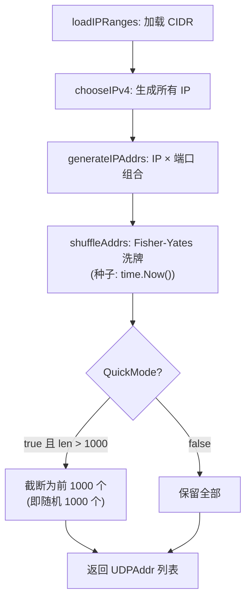

# Warp Speed Test 二进制分析报告

> 更新于 2026-02-18 21:33：更正了随机采样和端口扫描机制的描述，补充了 Docker 集成的网络需求。

## 概要

`warp-linux-amd64` 是 Cloudflare Warp 端点延迟测量工具。通过向目标 IP:Port 发送 WireGuard Handshake Initiation 包并测量 RTT 来评估延迟和丢包率。

---

## 1. IP 选择与采样

### 1.1 CIDR 范围加载 (`loadIPRanges`)
- 硬编码 8 个 IPv4 `/24` 和 2 个 IPv6 `/48` CIDR 范围（详见 `extracted_ip_ranges.txt`）
- 可通过 `-f` 或 `-ip` 参数覆盖

### 1.2 IP 生成 (`chooseIPv4`)
遍历 CIDR 块中所有 IP，对于每个 `/24` 生成 ~256 个地址。

### 1.3 端口分配 (`generateIPAddrs`)
为每个 IP 分配端口，生成 `UDPAddr(IP, Port)` 组合：

| 模式 | 行为 |
|---|---|
| **默认模式** | 遍历 `task.ports` 数组中的 **54 个预定义端口** |
| **全端口模式** (`-full`) | 遍历端口 **1 到 10000** (`MaxWarpPortRange`) |

**默认 54 个端口列表：**
```
500, 854, 859, 864, 878, 880, 890, 891, 894, 903,
908, 928, 934, 939, 942, 943, 945, 946, 955, 968,
987, 988, 1002, 1010, 1014, 1018, 1070, 1074, 1180, 1387,
1701, 1843, 2371, 2408, 2506, 3138, 3476, 3581, 3854, 4177,
4198, 4233, 4500, 5279, 5956, 7103, 7152, 7156, 7281, 7559,
8319, 8742, 8854, 8886
```

### 1.4 洗牌与快速模式 (`shuffleAddrs` + `loadWarpIPRanges`)



> [!IMPORTANT]
> **QuickMode（默认开启）是真正的随机采样**：先对所有 IP×端口组合进行 Fisher-Yates 洗牌，再截取前 1000 个。这等效于从全集中随机抽取 1000 个不重复样本。

---

## 2. 延迟测量

### 2.1 调用链
```
Run → Run.func1 → start → warpingHandler → warping → handshake
```

### 2.2 `warping` 函数 (0x742140)
1. `net.DialTimeout("udp", ip:port, 1s)` 建立 UDP 连接
2. 循环 `PingTimes` 次（默认 10），每次调用 `handshake(conn)`
3. 累计成功次数和总延迟

### 2.3 `handshake` 函数 (0x742300)
1. `time.Now()` 记录起始时间
2. **发送** 预计算的 `warpHandshakePacket`（148 字节 WireGuard Handshake Initiation）
3. 设置 **1 秒读超时** (`SetReadDeadline`)
4. **接收** 响应，检查是否恰好 **92 字节**（WireGuard Handshake Response）
5. 成功则返回 `time.Since(start)` 作为该次 RTT

### 2.4 结果处理 (`warpingHandler`)
- 平均延迟 = `totalDelay / received`
- 填充 `PingData{IP, Sended, Received, Delay}` → 追加到 CSV 结果集
- 按 `InputMaxDelay`/`InputMinDelay`/`InputMaxLossRate` 过滤后排序输出

---

## 3. Docker 集成需求

### 网络要求
| 项目 | 要求 |
|---|---|
| 协议 | **UDP** 出站 |
| 端口范围 | 默认模式: 54 个特定端口 (500-8886)；全端口模式: 1-10000 |
| 特权 | **不需要** `NET_ADMIN`、`NET_RAW` 等特殊权限 |
| 套接字 | 标准 `net.DialTimeout`，非 raw socket |

> [!WARNING]
> 容器必须允许 **UDP 出站** 到目标 IP 的上述端口。如果使用 `--network=host` 则无此限制；如使用 bridge 网络，默认出站 UDP 通常不受限（NAT 转发），无需额外配置。

### 运行时参数
| 参数 | 默认值 | 说明 |
|---|---|---|
| `-n` | 200 | 并发线程数 |
| `-t` | 10 | 每 IP 握手次数 |
| `-q` | true | 快速模式（随机 1000 个地址） |
| `-tl` | 300ms | 延迟上限 |
| `-tlr` | 1.0 | 丢包率上限 |
| `-o` | result.csv | 输出文件 |
| `-full` | false | 全端口扫描 (1-10000) |
